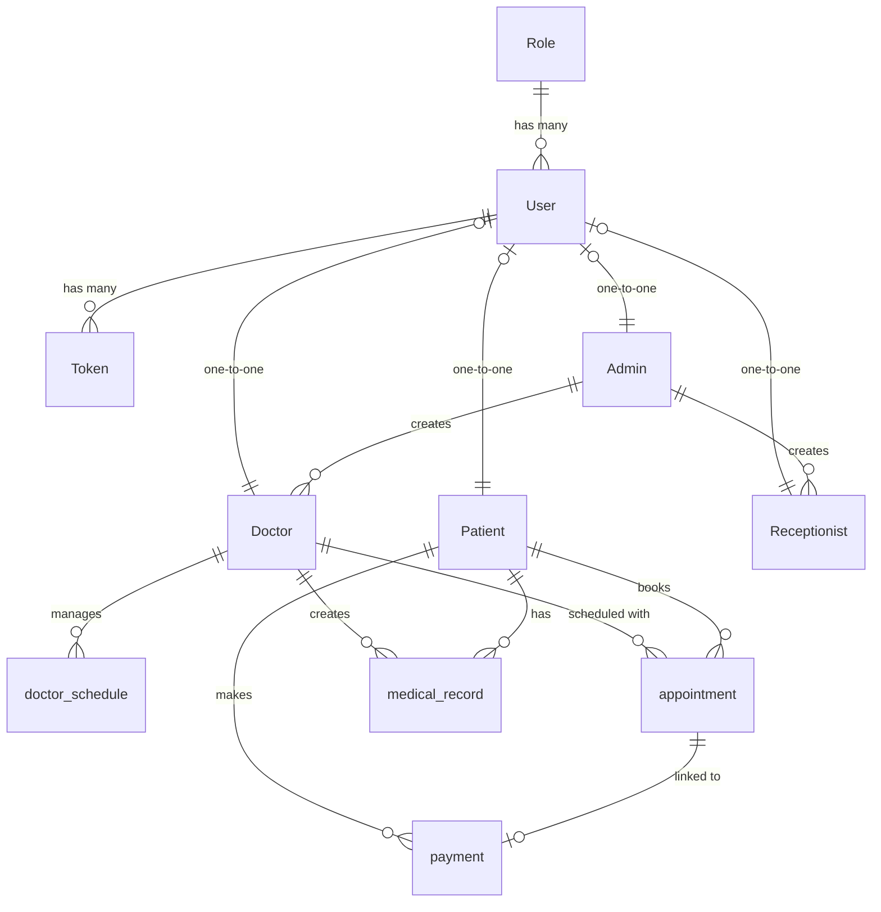

# Pubudu Medical Center - Final Database Schema Model

This document outlines the current, aligned entity-relationship model and physical column definitions for the database, matching the Sequelize models and frontend implementation.

## 1. Entity Relationship Diagram

## 2. Table Column Definitions

### 2.1 `role`
| Column | Type | Description |
| :--- | :--- | :--- |
| `role_id` | INTEGER | PK, auto-increment |
| `role_name` | STRING(15) | ADMIN (1), DOCTOR (2), RECEPTIONIST (3), PATIENT (4) |

### 2.2 `user`
| Column | Type | Description |
| :--- | :--- | :--- |
| `user_id` | INTEGER | PK, auto-increment |
| `username` | STRING(50) | Unique username |
| `password_hash`| STRING(255) | Hashed password |
| `role_id` | INTEGER | FK -> role.role_id |
| `contact_number`| STRING(15) | Meta contact |
| `email` | STRING(100) | Meta email |
| `is_verified` | BOOLEAN | Account verification status |
| `status` | ENUM | ACTIVE, INACTIVE, SUSPENDED |

### 2.3 `patient`
| Column | Type | Description |
| :--- | :--- | :--- |
| `patient_id` | INTEGER | PK, auto-increment |
| `user_id` | INTEGER | FK -> user.user_id |
| `full_name` | STRING(100) | Display name |
| `nic` | STRING(15) | National Identification Card |
| `gender` | ENUM | MALE, FEMALE, OTHER |
| `date_of_birth`| DATEONLY | Patient birthday |
| `address` | STRING(255) | Residential address |
| `blood_group` | STRING(10) | Patient blood type |
| `allergies` | TEXT | Known allergies |
| `registration_source` | ENUM | ONLINE, RECEPTIONIST |

### 2.4 `doctor`
| Column | Type | Description |
| :--- | :--- | :--- |
| `doctor_id` | INTEGER | PK, auto-increment |
| `user_id` | INTEGER | FK -> user.user_id |
| `admin_id` | INTEGER | FK -> admin.admin_id |
| `full_name` | STRING(100) | Full name |
| `specialization`| STRING(100) | Expert field |
| `license_no` | STRING(50) | SLMC license |
| `doctor_fee` | DECIMAL | Consultation fee |
| `center_fee` | DECIMAL | Center service charge (Default: 600) |
| `status` | ENUM | ACTIVE, ON_LEAVE, INACTIVE |

### 2.5 `receptionist`
| Column | Type | Description |
| :--- | :--- | :--- |
| `receptionist_id`| INTEGER | PK, auto-increment |
| `user_id` | INTEGER | FK -> user.user_id |
| `admin_id` | INTEGER | FK -> admin.admin_id |
| `full_name` | STRING(100) | Full name |
| `nic` | STRING(15) | National Identification Card |

### 2.6 `doctor_schedule` (Availability)
| Column | Type | Description |
| :--- | :--- | :--- |
| **`schedule_id`** | INTEGER | PK, auto-increment |
| `doctor_id` | INTEGER | FK -> doctor.doctor_id |
| `day_of_week` | ENUM | e.g., "MONDAY" |
| **`schedule_date`**| DATEONLY | Specific date for one-time availability |
| `start_time` | TIME | Session start |
| `end_time` | TIME | Session end |
| `end_date` | DATEONLY | Recurring session expiration |
| `created_at` | TIMESTAMP | Creation time |
| `updated_at` | TIMESTAMP | Last update time |

### 2.7 `appointment`
| Column | Type | Description |
| :--- | :--- | :--- |
| `appointment_id`| INTEGER | PK, auto-increment |
| `patient_id` | INTEGER | FK -> patient.patient_id |
| `doctor_id` | INTEGER | FK -> doctor.doctor_id |
| `appointment_date`| DATEONLY | Scheduled date |
| **`schedule_id`** | INTEGER | FK -> doctor_schedule.schedule_id |
| `time_slot` | STRING(20) | Session time range |
| `status` | ENUM | PENDING, CONFIRMED, CANCELLED, COMPLETED |
| `payment_status`| ENUM | UNPAID, PAID, PARTIAL |
| `appointment_number`| INTEGER | Queue sequence |

### 2.8 `payment`
| Column | Type | Description |
| :--- | :--- | :--- |
| `payment_id` | INTEGER | PK, auto-increment |
| `patient_id` | INTEGER | FK -> patient.patient_id |
| `appointment_id`| INTEGER | FK -> appointment.appointment_id |
| `amount` | DECIMAL | Transaction total |
| `payment_method`| ENUM | Online Payment, Pay at Clinic |
| `payment_status`| STRING(20) | PAID, PENDING, FAILED |
| `transaction_id`| STRING(100) | gateway reference |

### 2.9 `medical_record`
| Column | Type | Description |
| :--- | :--- | :--- |
| `record_id` | INTEGER | PK, auto-increment |
| `patient_id` | INTEGER | FK -> patient.patient_id |
| `doctor_id` | INTEGER | FK -> doctor.doctor_id |
| `record_date` | DATEONLY | Entry date |
| `diagnosis` | TEXT | Assessment findings |
| `prescription` | TEXT | Medication/Dosage |
| `notes` | TEXT | Clinical notes |

---

## 3. Notable Alignment Refactors
- **Field Renaming**: Aligned `availability_id` -> `schedule_id` and `specific_date` -> `schedule_date` to prevent mismatch with the physical MySQL table.
- **Obsolete Cleanup**: Physically removed the `status` column from the `doctor_schedule` table and its code-level alias `session_name`.
- **Consistency**: Unified field naming across Backend (Sequelize Models, Controllers) and Frontend (Doctor Portal, Patient Booking, Receptionist Wizard).
