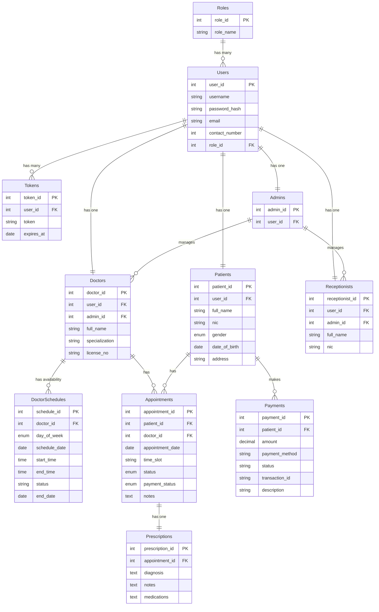

# Database Schema Report

This document details the database schema for the Pubudu Medical Center application. The system uses Sequelize ORM with a relational database (likely MySQL or SQLite based on the configuration).

## Entity-Relationship Diagram

## Table Definitions

### 1. `users`
Core user table for authentication and authorization.
- **user_id** (`INTEGER`, PK, Auto-Increment): Unique identifier.
- **username** (`STRING(50)`, Unique, Not Null): Username for login.
- **password_hash** (`STRING(255)`, Not Null): Bcrypt hashed password.
- **email** (`STRING(100)`, Nullable): Contact email.
- **contact_number** (`INTEGER`, Nullable): Contact phone number.
- **role_id** (`INTEGER`, FK, Not Null): References `role.role_id`.

### 2. `role`
Defines user roles (e.g., ADMIN, DOCTOR, PATIENT, RECEPTIONIST).
- **role_id** (`INTEGER`, PK, Auto-Increment): Unique identifier.
- **role_name** (`STRING(15)`, Unique, Not Null): Name of the role.

### 3. `tokens`
Stores authentication tokens (refresh tokens).
- **token_id** (`INTEGER`, PK, Auto-Increment): Unique identifier.
- **user_id** (`INTEGER`, FK, Not Null): References `users.user_id`.
- **token** (`STRING(255)`, Not Null): The token string.
- **expires_at** (`DATE`, Not Null): Expiration timestamp.

### 4. `admin`
Extensions for users with Administrator role.
- **admin_id** (`INTEGER`, PK, Auto-Increment): Unique identifier.
- **user_id** (`INTEGER`, FK, Unique, Not Null): References `users.user_id`.

### 5. `patient`
Profiles for patients.
- **patient_id** (`INTEGER`, PK, Auto-Increment): Unique identifier.
- **user_id** (`INTEGER`, FK, Unique, Not Null): References `users.user_id`.
- **full_name** (`STRING(100)`, Not Null): Full legal name.
- **nic** (`STRING(15)`, Unique, Not Null): National Identity Card number.
- **gender** (`ENUM('MALE', 'FEMALE', 'OTHER')`, Nullable).
- **date_of_birth** (`DATEONLY`, Nullable).
- **address** (`STRING(255)`, Nullable).

### 6. `doctor`
Profiles for medical practitioners.
- **doctor_id** (`INTEGER`, PK, Auto-Increment): Unique identifier.
- **user_id** (`INTEGER`, FK, Unique, Not Null): References `users.user_id`.
- **admin_id** (`INTEGER`, FK, Nullable): References `admin.admin_id` (creator).
- **full_name** (`STRING(100)`, Not Null): Doctor's name with title.
- **specialization** (`STRING(100)`, Not Null): Medical field (e.g., Cardiology).
- **license_no** (`STRING(50)`, Unique, Not Null): Medical license number.

### 7. `receptionist`
Profiles for front-desk staff.
- **receptionist_id** (`INTEGER`, PK, Auto-Increment): Unique identifier.
- **user_id** (`INTEGER`, FK, Unique, Not Null): References `users.user_id`.
- **admin_id** (`INTEGER`, FK, Nullable): References `admin.admin_id` (creator).
- **full_name** (`STRING(100)`, Not Null): Staff name.
- **nic** (`STRING(15)`, Unique, Not Null): National Identity Card number.

### 8. `doctor_schedule` (Model: `Availability`)
Stores doctor availability slots.
- **schedule_id** (`INTEGER`, PK, Auto-Increment): Unique identifier (mapped from `availability_id`).
- **doctor_id** (`INTEGER`, FK, Not Null): References `doctor.doctor_id`.
- **day_of_week** (`ENUM`, Nullable): Day name for recurring schedules (MONDAY-SUNDAY).
- **schedule_date** (`DATEONLY`, Nullable): Specific date for one-off availability.
- **start_time** (`TIME`, Not Null): Start of available slot.
- **end_time** (`TIME`, Not Null): End of available slot.
- **status** (`STRING(100)`, Nullable): Session name/status (mapped to `session_name`).
- **end_date** (`DATEONLY`, Nullable): End date for recurring schedules.
- **created_at**, **updated_at**: Timestamps.

### 9. `appointment`
Stores booking details.
- **appointment_id** (`INTEGER`, PK, Auto-Increment): Unique identifier.
- **patient_id** (`INTEGER`, FK, Not Null): References `patient.patient_id`.
- **doctor_id** (`INTEGER`, FK, Not Null): References `doctor.doctor_id`.
- **appointment_date** (`DATEONLY`, Not Null): Date of appointment.
- **time_slot** (`STRING(20)`, Not Null): Time range (e.g., "10:00 AM - 10:15 AM").
- **status** (`ENUM`, Default: 'PENDING'): PENDING, CONFIRMED, CANCELLED, COMPLETED.
- **payment_status** (`ENUM`, Default: 'UNPAID'): UNPAID, PAID, PARTIAL.
- **notes** (`TEXT`, Nullable): Additional notes.
- **created_at**, **updated_at**: Timestamps.

### 10. `payment`
Financial records for consultations.
- **payment_id** (`INTEGER`, PK, Auto-Increment): Unique identifier.
- **patient_id** (`INTEGER`, FK, Not Null): References `patient.patient_id`.
- **amount** (`DECIMAL(10, 2)`, Not Null): Payment amount.
- **payment_method** (`STRING(50)`, Not Null): e.g., Card, Cash.
- **status** (`STRING(20)`, Default: 'SUCCESS'): Payment status.
- **transaction_id** (`STRING(100)`, Unique, Not Null): External reference.
- **description** (`STRING(255)`, Nullable).
- **created_at**, **updated_at**: Timestamps.

### 11. `prescription`
Medical records linked to appointments.
- **prescription_id** (`INTEGER`, PK, Auto-Increment): Unique identifier.
- **appointment_id** (`INTEGER`, FK, Unique, Not Null): References `appointment.appointment_id`.
- **diagnosis** (`TEXT`, Nullable): Medical diagnosis.
- **notes** (`TEXT`, Nullable): Doctor's notes.
- **medications** (`TEXT`, Nullable): Prescribed medicines.
- **created_at**, **updated_at**: Timestamps.
